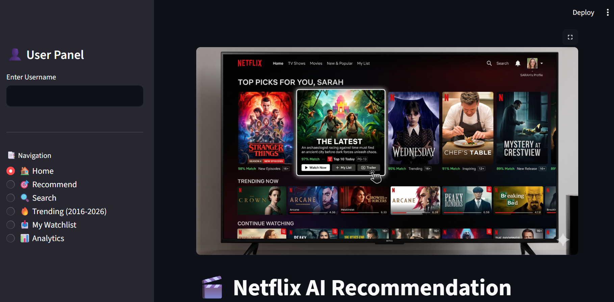
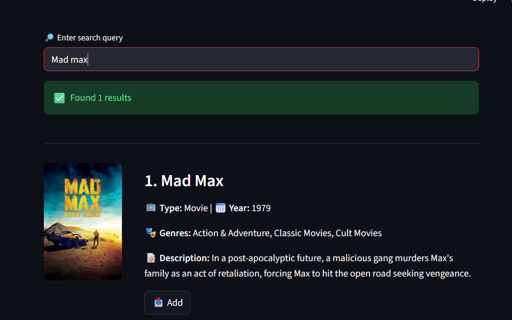

# Netflix-ai-dashboard
This is my first Git Repository.
# 🎬 Netflix AI Recommendation Engine

An AI-powered movie recommendation system that leverages Natural Language Processing (NLP), semantic embeddings, and vector similarity search to provide intelligent Netflix content recommendations.

Built with Python, Sentence Transformers, FAISS, and Streamlit, this project demonstrates modern recommendation system techniques used in real-world AI applications.

---

## 🚀 Project Overview

Traditional recommendation systems often rely on ratings and user behavior. This project focuses on **content-based recommendations** using semantic understanding of movie metadata.

By converting movie descriptions into vector embeddings and performing similarity search with FAISS, the system recommends movies that are contextually similar to a selected title.

---

## ✨ Key Features

* AI-powered movie recommendations
* Semantic search using transformer embeddings
* High-speed similarity search with FAISS
* Interactive Streamlit dashboard
* Netflix dataset processing pipeline
* Data cleaning and preprocessing workflow
* Embedding generation and indexing
* Scalable recommendation architecture

---

## 🛠️ Tech Stack

| Category             | Technology                |
| -------------------- | ------------------------- |
| Programming Language | Python                    |
| Frontend             | Streamlit                 |
| Machine Learning     | Sentence Transformers     |
| Vector Search        | FAISS                     |
| Data Processing      | Pandas, NumPy             |
| Model Storage        | Pickle                    |
| Visualization        | Plotly                    |
| Dataset              | Netflix Movies & TV Shows |

---

## 📂 Project Structure

```text
Netflix-ai-dashboard/
│
├── streamlit_app.py
├── recommender.py
├── embeddings.py
├── preprocessing.py
├── data_pipeline.py
├── build_models.py
├── config.py
│
├── data/
│   ├── movies_on_netflix.csv
│   └── processed/
│
├── models/
│   ├── v2_df.pkl
│   ├── v2_embeddings.npy
│   └── v2_index.faiss
│
├── requirements.txt
├── requirements_windows.txt
└── README.md
```

---

## ⚙️ Installation

### 1. Clone the Repository

```bash
git clone https://github.com/TishaSutariya/Netflix-ai-dashboard.git

cd Netflix-ai-dashboard
```

### 2. Create Virtual Environment

```bash
python -m venv venv
```

Activate:

**Windows**

```bash
venv\Scripts\activate
```

**Linux / macOS**

```bash
source venv/bin/activate
```

### 3. Install Dependencies

```bash
pip install -r requirements.txt
```

### 4. Build Recommendation Models

```bash
python build_models.py
```

### 5. Launch Application

```bash
streamlit run streamlit_app.py
```

---

## 🧠 How the Recommendation System Works

### Step 1: Data Preprocessing

* Clean movie metadata
* Handle missing values
* Standardize textual information
* Prepare recommendation features

### Step 2: Embedding Generation

Movie descriptions are converted into dense vector representations using:

```python
all-MiniLM-L6-v2
```

from Sentence Transformers.

### Step 3: Vector Index Creation

Embeddings are indexed using FAISS for efficient similarity search.

### Step 4: Recommendation Generation

When a user selects a movie:
1. Retrieve movie embedding
2. Query FAISS index
3. Find nearest neighbors
4. Return most similar titles
---
## 📊 Project Workflow
text
Raw Netflix Dataset
        │
        ▼
Data Cleaning & Preprocessing
        │
        ▼
Text Embedding Generation
        │
        ▼
FAISS Vector Index
        │
        ▼
Similarity Search
        │
        ▼
Movie Recommendations

---
## 📸 Application Screenshots
### Home Dashboard

### Recommendation Engine

### Search Interface

---
## 🎯 Learning Outcomes

This project demonstrates practical experience with:

* Recommendation Systems
* Natural Language Processing
* Semantic Search
* Vector Databases
* FAISS Indexing
* Machine Learning Pipelines
* Data Engineering Workflows
* Interactive Data Applications

---

## 🔮 Future Improvements

* Hybrid recommendation system
* Collaborative filtering integration
* Personalized user profiles
* Real-time recommendation updates
* Cloud deployment
* Docker support
* LLM-powered recommendation explanations

---

## 👩‍💻 Author

**Tisha Sutariya**

Data Science & AI Enthusiast

GitHub: https://github.com/TishaSutariya

---